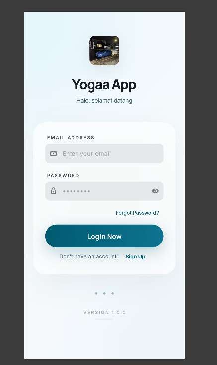
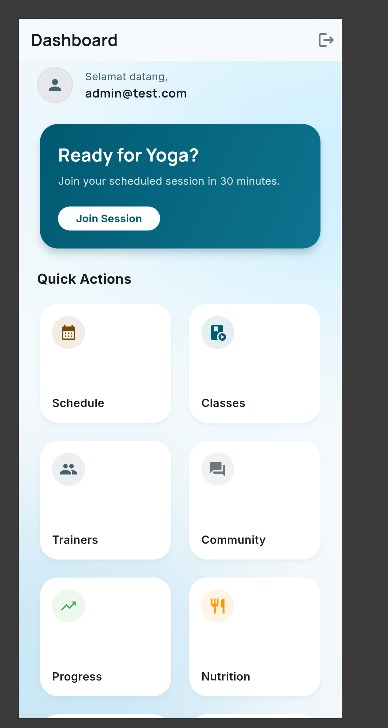
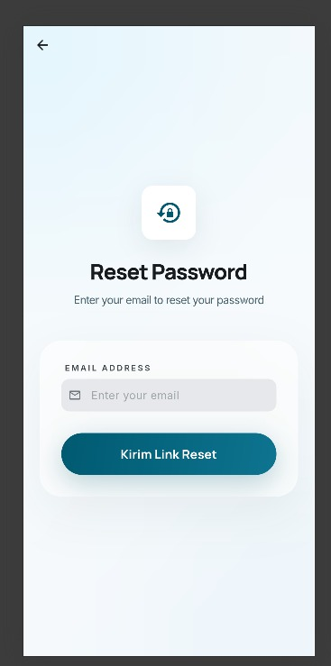

# Yogaa App

## 📱 Deskripsi Aplikasi

Yogaa App adalah aplikasi mobile berbasis Flutter yang dibuat untuk memenuhi tugas UTS Mobile Programming. Aplikasi ini memiliki fitur login, dashboard, dan pengelolaan akun sederhana.

---

## ✨ Fitur Aplikasi

* Halaman Login
* Halaman Dashboard
* Fitur Forgot Password
* Navigasi antar halaman
* UI sederhana menggunakan Flutter

---

## 🚀 Cara Menjalankan Aplikasi

1. Clone repository

```
git clone https://github.com/yogasaputra206/yogaa_app.git
```

2. Masuk ke folder project

```
cd yogaa_app
```

3. Install dependency

```
flutter pub get
```

4. Jalankan aplikasi

```
flutter run
```

---

## 📸 Screenshot Aplikasi

Tambahkan screenshot di folder assets/images lalu tampilkan di sini:






* Halaman Login
* Halaman Dashboard
* Halaman Forgot Password

---

## 📦 Package yang Digunakan

* flutter
* google_fonts

// menambahkan README sesuai tugas UTS